# Diagrama de Clases

## Sistema de Gestión Inteligente de Tráfico Urbano

```mermaid
classDiagram
    class Sensor {
        <<abstract>>
        -sensor_id: str
        -tipo_sensor: str
        -col: int
        -row: int
        -interseccion: str
        -broker_host: str
        -broker_port: int
        -frequency: float
        -auth_token: str
        -context: zmq.Context
        -socket: zmq.Socket
        +connect()
        +generate_data()* dict
        +create_event() SensorEvent
        +publish(event: SensorEvent)
        +run()
        +stop()
    }

    class SensorEspira {
        -min_val: float
        -max_val: float
        -spike_prob: float
        +generate_data() dict
    }

    class SensorCamara {
        -min_val: int
        -max_val: int
        -spike_prob: float
        +generate_data() dict
    }

    class SensorGPS {
        -d_min: float
        -d_max: float
        -v_min: float
        -v_max: float
        -spike_prob: float
        +generate_data() dict
    }

    class BrokerZMQ {
        -frontend_port: int
        -backend_port: int
        -bind_address: str
        -context: zmq.Context
        -frontend: zmq.Socket
        -backend: zmq.Socket
        +start()
        +stop()
    }

    class AnalyticsService {
        -config: dict
        -thresholds: dict
        -intersection_metrics: dict
        -registered_sensors: set
        -use_replica: bool
        -last_heartbeat_time: float
        -replica_db: DatabaseManager
        +evaluate_traffic(interseccion: str) str
        +update_metrics(event: SensorEvent)
        +process_event(event, push, light_pub)
        +handle_monitoring(rep_socket)
        +monitor_heartbeat(hb_socket)
        +run()
    }

    class TrafficLightController {
        -config: dict
        -light_states: dict
        -db: DatabaseManager
        +change_light(sem_id, estado, razon, origen)
        +get_state(sem_id: str) str
        +run()
    }

    class MonitoringService {
        -config: dict
        -auth_token: str
        -req_socket: zmq.Socket
        +connect()
        +send_request(req) MonitoringResponse
        +query_intersection(interseccion: str)
        +query_general()
        +send_override(sem_id, estado, motivo)
        +run_cli()
    }

    class DatabaseManager {
        -db_path: str
        -conn: sqlite3.Connection
        +connect()
        +close()
        +seed_all(cols, rows, dirs)
        +insert_event(...)
        +insert_traffic_state(...)
        +update_semaforo(...)
        +insert_light_action(...)
        +get_intersection_state(int_id) dict
        +get_all_semaforos() list
        +is_sensor_registered(sid) bool
        +get_event_count() int
    }

    class MainDBService {
        -config: dict
        -sequence_number: int
        -db: DatabaseManager
        +send_heartbeat(hb_pub)
        +publish_replication(rep_pub, tabla, op, datos)
        +process_traffic_state(state, rep_pub)
        +run()
    }

    class ReplicaDBService {
        -config: dict
        -last_sequence: int
        -db: DatabaseManager
        +apply_replication(rep_msg)
        +run()
    }

    class MessageValidator {
        +validate_sensor_event(data, sensors, tokens)$ tuple
        +validate_override_command(data, token)$ tuple
        +validate_query(data)$ tuple
    }

    class SensorEvent {
        <<dataclass>>
        +sensor_id: str
        +tipo_sensor: str
        +interseccion: str
        +datos: dict
        +auth_token: str
        +message_id: str
        +timestamp: str
        +to_json() str
        +from_json(raw)$ SensorEvent
    }

    class TrafficState {
        <<dataclass>>
        +interseccion: str
        +estado: str
        +metricas: dict
        +accion_tomada: dict
        +to_json() str
        +from_json(raw)$ TrafficState
    }

    class LightAction {
        <<dataclass>>
        +semaforo_id: str
        +nuevo_estado: str
        +razon: str
        +comando: str
        +prioridad: bool
        +to_json() str
        +from_json(raw)$ LightAction
    }

    Sensor <|-- SensorEspira
    Sensor <|-- SensorCamara
    Sensor <|-- SensorGPS
    Sensor ..> SensorEvent : creates
    AnalyticsService ..> SensorEvent : processes
    AnalyticsService ..> TrafficState : creates
    AnalyticsService ..> LightAction : creates
    AnalyticsService ..> MessageValidator : uses
    AnalyticsService --> DatabaseManager : replica_db
    TrafficLightController --> DatabaseManager : db
    TrafficLightController ..> LightAction : receives
    MainDBService --> DatabaseManager : db
    ReplicaDBService --> DatabaseManager : db
    MonitoringService ..> AnalyticsService : REQ/REP
```

## Relaciones Principales

| Relación | Tipo | Descripción |
|----------|------|-------------|
| Sensor → SensorEspira/Camara/GPS | Herencia | Clases concretas de sensores |
| Sensor → SensorEvent | Creación | Cada sensor genera eventos |
| AnalyticsService → MessageValidator | Uso | Valida eventos antes de procesarlos |
| AnalyticsService → DatabaseManager | Composición | Usa replica DB para failover |
| MainDBService → DatabaseManager | Composición | Gestiona la BD principal |
| ReplicaDBService → DatabaseManager | Composición | Gestiona la BD réplica |
