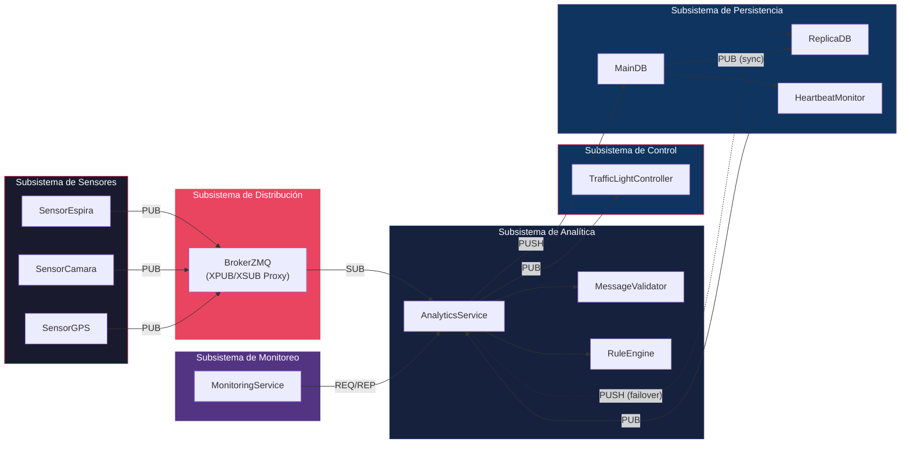

# Diagrama de Componentes

## Sistema de Gestión Inteligente de Tráfico Urbano

## Interfaces entre Componentes

| Interfaz | Proveedor | Consumidor | Tipo |
|----------|-----------|------------|------|
| ISensorPublish | Sensor* | BrokerZMQ | ZMQ PUB |
| IBrokerForward | BrokerZMQ | AnalyticsService | ZMQ XPUB/SUB |
| IEventValidation | MessageValidator | AnalyticsService | Método interno |
| IRuleEvaluation | RuleEngine | AnalyticsService | Método interno |
| ILightCommand | AnalyticsService | TrafficLightController | ZMQ PUB/SUB |
| IDataPersist | AnalyticsService | MainDB | ZMQ PUSH/PULL |
| IMonitorQuery | MonitoringService | AnalyticsService | ZMQ REQ/REP |
| IReplication | MainDB | ReplicaDB | ZMQ PUB/SUB |
| IHeartbeat | MainDB | AnalyticsService | ZMQ PUB/SUB |
| IFailoverWrite | AnalyticsService | ReplicaDB | Direct DB write |

## Dependencias

- **AnalyticsService** depende de: BrokerZMQ, MessageValidator, RuleEngine, MainDB/ReplicaDB
- **TrafficLightController** depende de: AnalyticsService (comandos)
- **MonitoringService** depende de: AnalyticsService (consultas)
- **ReplicaDB** depende de: MainDB (replicación), AnalyticsService (failover)
