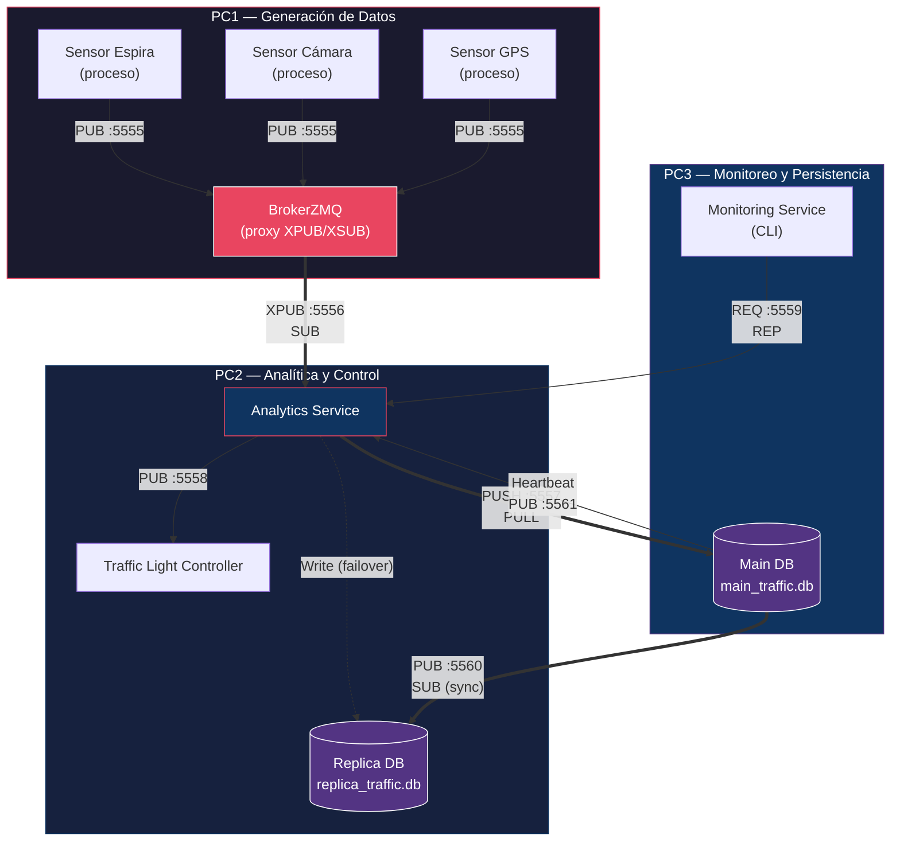

# Diagrama de Despliegue

## Sistema de Gestión Inteligente de Tráfico Urbano

## Descripción de Nodos

| Nodo | Host | Componentes | Artefactos |
|------|------|-------------|------------|
| PC1 | `pc1_host` | Sensor Espira, Sensor Cámara, Sensor GPS, BrokerZMQ | `sensor_espira.py`, `sensor_camara.py`, `sensor_gps.py`, `broker.py` |
| PC2 | `pc2_host` | Analytics Service, Traffic Light Controller, Replica DB | `analytics_service.py`, `traffic_light_controller.py`, `replica_db.py`, `replica_traffic.db` |
| PC3 | `pc3_host` | Monitoring Service, Main DB | `monitoring_service.py`, `main_db.py`, `main_traffic.db` |

## Canales de Comunicación

| Canal | Protocolo | Puerto | Patrón ZMQ |
|-------|-----------|--------|------------|
| Sensores → Broker | TCP | 5555 | PUB → XSUB |
| Broker → Analytics | TCP | 5556 | XPUB → SUB |
| Analytics → Main DB | TCP | 5557 | PUSH → PULL |
| Analytics → Semáforos | TCP | 5558 | PUB → SUB |
| Monitoring ↔ Analytics | TCP | 5559 | REQ → REP |
| Main DB → Replica DB | TCP | 5560 | PUB → SUB |
| Main DB → Analytics (heartbeat) | TCP | 5561 | PUB → SUB |
