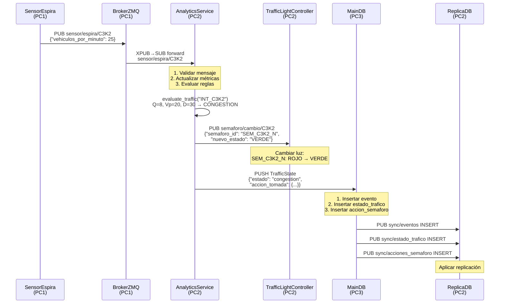
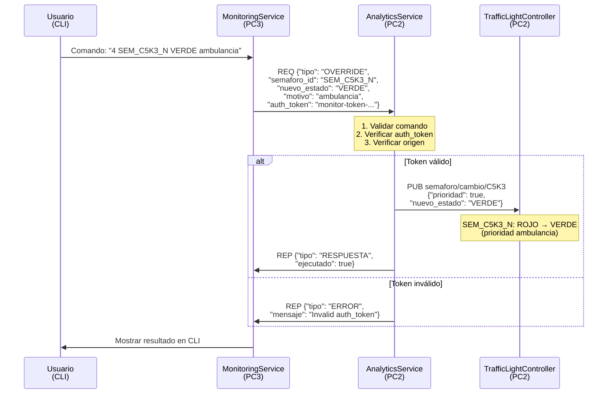
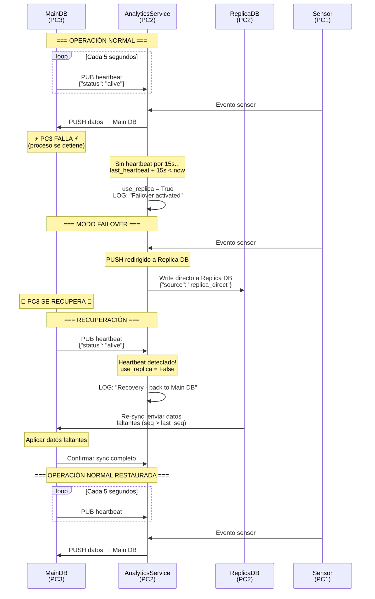

# Diagramas de Secuencia

## Sistema de Gestión Inteligente de Tráfico Urbano

---

## 1. Flujo Normal: Sensor → Broker → Analytics → DB

Flujo completo cuando un sensor detecta congestión y se cambia un semáforo.

---

## 2. Override Manual: Usuario → Monitoring → Analytics → Semáforo

Flujo cuando un operador envía un comando de prioridad (ej: ambulancia).

---

## 3. Flujo de Failover: Caída de PC3 → Replica DB → Recuperación

Flujo completo del mecanismo de tolerancia a fallos.

---

## Resumen de Patrones ZMQ por Flujo

| Flujo | Patrón | Dirección |
|-------|--------|-----------|
| Sensor → Broker | PUB → XSUB | Unidireccional |
| Broker → Analytics | XPUB → SUB | Unidireccional |
| Analytics → DB | PUSH → PULL | Unidireccional |
| Analytics → Semáforos | PUB → SUB | Unidireccional |
| Monitoring ↔ Analytics | REQ → REP | Bidireccional (síncrono) |
| Main DB → Replica DB | PUB → SUB | Unidireccional |
| Heartbeat | PUB → SUB | Unidireccional (periódico) |
