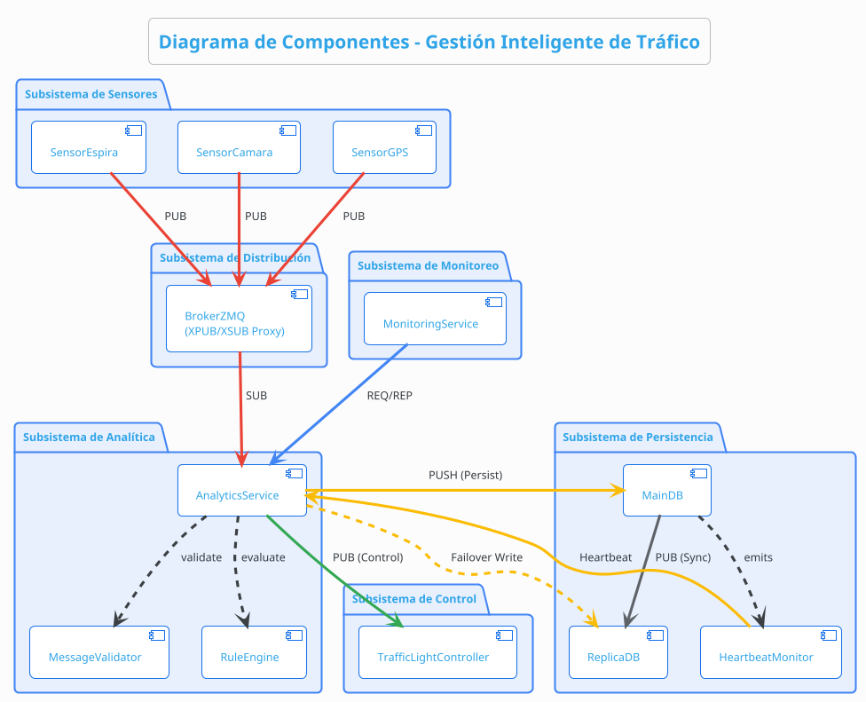
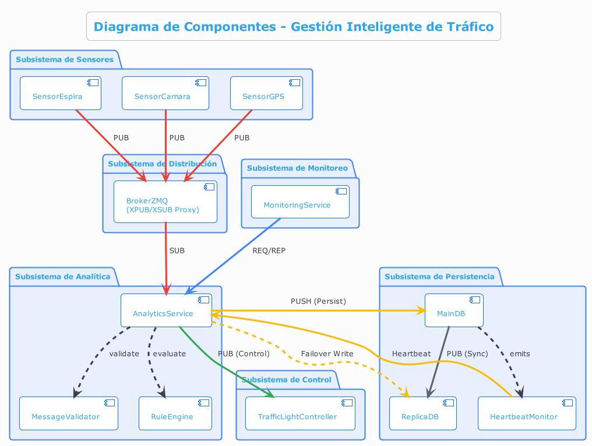

# Diagrama de Componentes (PlantUML)

## Sistema de Gestión Inteligente de Tráfico Urbano

```plantuml
@startuml
!theme cerulean-outline
skinparam backgroundColor #fcfcfc
skinparam roundcorner 10
skinparam shadowing false
skinparam handwritten false

skinparam component {
    BackgroundColor #FFFFFF
    BorderColor #1A73E8
    ArrowColor #3C4043
}

skinparam package {
    BackgroundColor #E8F0FE
    BorderColor #4285F4
}

title Diagrama de Componentes - Gestión Inteligente de Tráfico

package "Subsistema de Sensores" {
    component [SensorEspira] as SE
    component [SensorCamara] as SC
    component [SensorGPS] as SG
}

package "Subsistema de Distribución" {
    component [BrokerZMQ\n(XPUB/XSUB Proxy)] as BRK
}

package "Subsistema de Analítica" {
    component [AnalyticsService] as ANA
    component [MessageValidator] as VAL
    component [RuleEngine] as RUL
    
    ANA ..> VAL : validate
    ANA ..> RUL : evaluate
}

package "Subsistema de Control" {
    component [TrafficLightController] as TLC
}

package "Subsistema de Monitoreo" {
    component [MonitoringService] as MON
}

package "Subsistema de Persistencia" {
    component [MainDB] as MDB
    component [ReplicaDB] as RDB
    component [HeartbeatMonitor] as HBM
    
    MDB ..> HBM : emits
}

' Connections
SE -[#EA4335]-> BRK : PUB
SC -[#EA4335]-> BRK : PUB
SG -[#EA4335]-> BRK : PUB

BRK -[#EA4335]-> ANA : SUB

ANA -[#34A853]-> TLC : PUB (Control)
ANA -[#FBBC05]-> MDB : PUSH (Persist)
ANA .[#FBBC05].> RDB : Failover Write

MON -[#4285F4]-> ANA : REQ/REP

MDB -[#5F6368]-> RDB : PUB (Sync)
HBM -[#FBBC05]-> ANA : Heartbeat

@enduml
```

## Vista Previa

