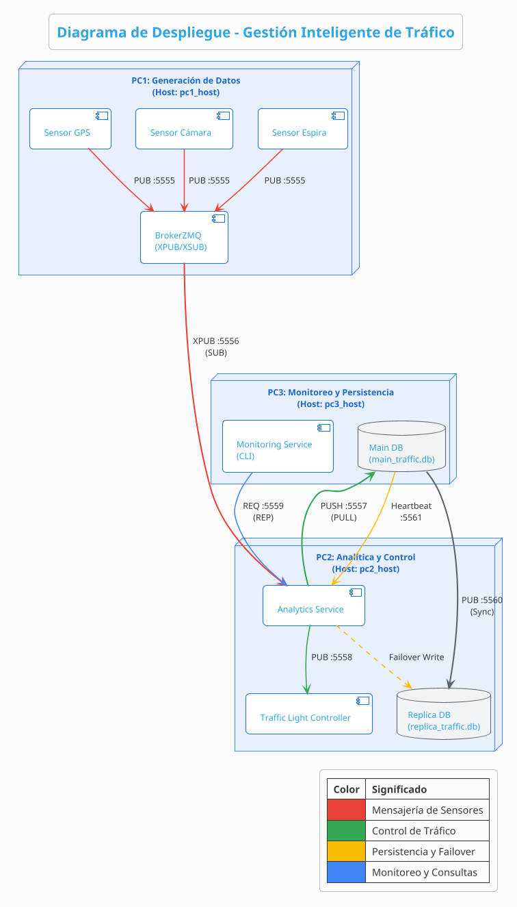
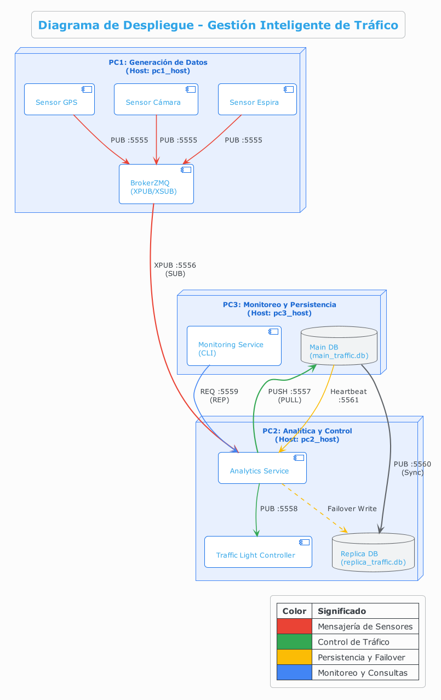

# Diagrama de Despliegue (PlantUML)

## Sistema de Gestión Inteligente de Tráfico Urbano

```plantuml
@startuml
!theme cerulean-outline
skinparam backgroundColor #fcfcfc
skinparam roundcorner 10
skinparam shadowing false
skinparam handwritten false

skinparam node {
    BackgroundColor #E8F0FE
    BorderColor #4285F4
    FontColor #1967D2
}

skinparam component {
    BackgroundColor #FFFFFF
    BorderColor #1A73E8
}

skinparam database {
    BackgroundColor #F1F3F4
    BorderColor #5F6368
}

skinparam arrow {
    Thickness 1.5
    Color #3C4043
}

title Diagrama de Despliegue - Gestión Inteligente de Tráfico

node "PC1: Generación de Datos\n(Host: pc1_host)" as PC1 {
    component "Sensor Espira" as S1
    component "Sensor Cámara" as S2
    component "Sensor GPS" as S3
    component "BrokerZMQ\n(XPUB/XSUB)" as BRK
    
    S1 -[#EA4335]-> BRK : PUB :5555
    S2 -[#EA4335]-> BRK : PUB :5555
    S3 -[#EA4335]-> BRK : PUB :5555
}

node "PC2: Analítica y Control\n(Host: pc2_host)" as PC2 {
    component "Analytics Service" as ANA
    component "Traffic Light Controller" as TLC
    database "Replica DB\n(replica_traffic.db)" as RDB
    
    ANA -[#34A853]-> TLC : PUB :5558
    ANA .[#FBBC05].> RDB : Failover Write
}

node "PC3: Monitoreo y Persistencia\n(Host: pc3_host)" as PC3 {
    component "Monitoring Service\n(CLI)" as MON
    database "Main DB\n(main_traffic.db)" as MDB
}

BRK ==[#EA4335]==> ANA : XPUB :5556\n(SUB)
ANA ==[#34A853]==> MDB : PUSH :5557\n(PULL)
MON -[#4285F4]-> ANA : REQ :5559\n(REP)
MDB ==[#5F6368]==> RDB : PUB :5560\n(Sync)
MDB -[#FBBC05]-> ANA : Heartbeat\n:5561

legend right
  |= Color |= Significado |
  |<#EA4335>| Mensajería de Sensores |
  |<#34A853>| Control de Tráfico |
  |<#FBBC05>| Persistencia y Failover |
  |<#4285F4>| Monitoreo y Consultas |
endlegend

@enduml
```

## Vista Previa

