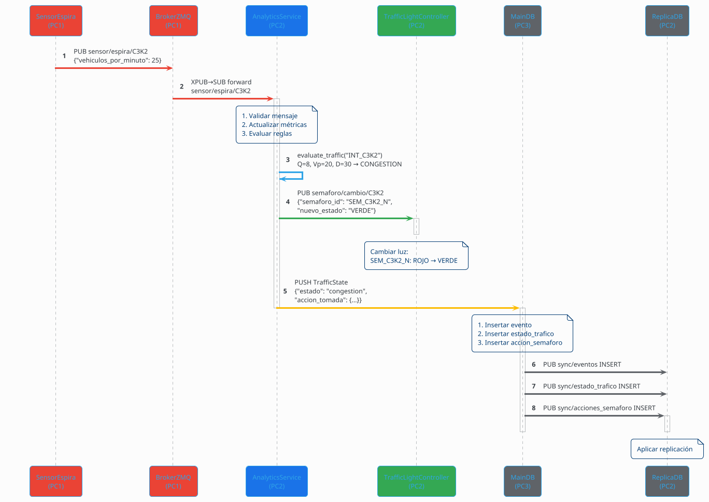
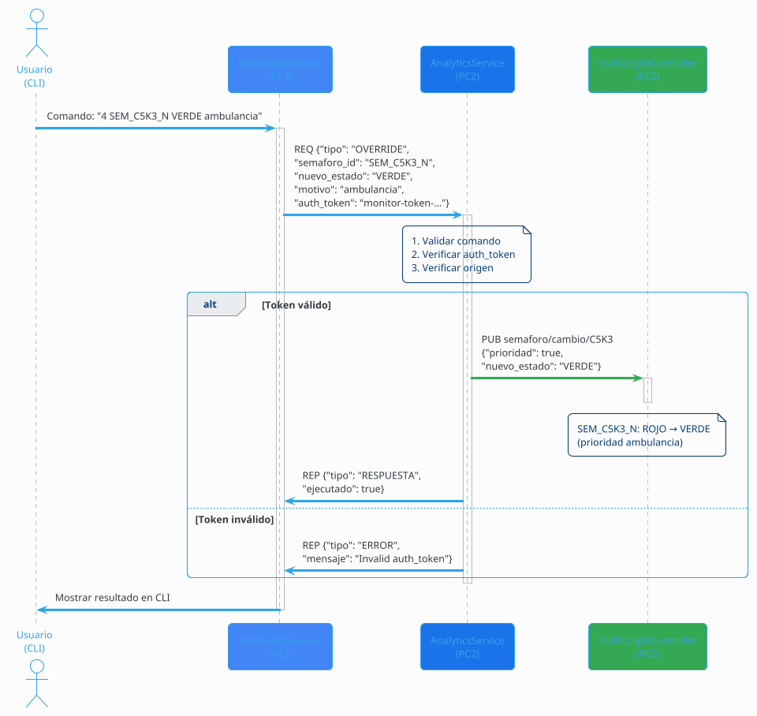
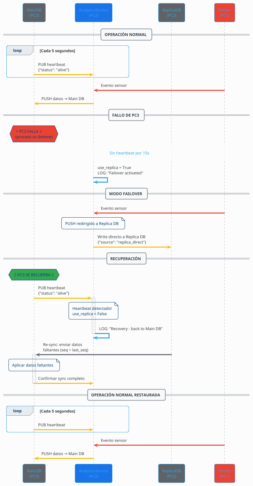

# Diagramas de Secuencia (PlantUML)

## Sistema de Gestión Inteligente de Tráfico Urbano

---

## 1. Flujo Normal: Sensor → Broker → Analytics → DB

---

## 2. Override Manual: Usuario → Monitoring → Analytics → Semáforo

---

## 3. Flujo de Failover: Caída de PC3 → Replica DB → Recuperación

